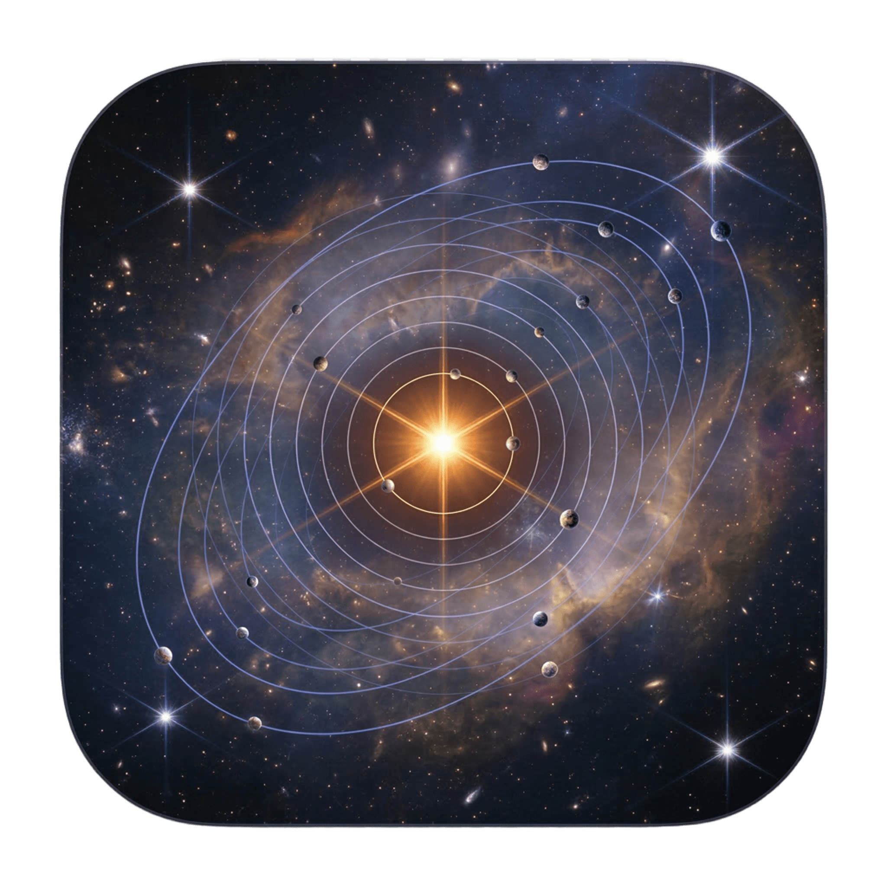

# Cosmodrome

**A native macOS terminal emulator for developers running multiple AI agents in parallel.**

One window. All projects visible. Agent state at a glance.

<!-- Badges: uncomment and update when applicable
[](https://github.com/rinaldofesta/cosmodrome/actions)
[](LICENSE)
[](https://developer.apple.com/macos/)
-->

<p align="center">
  
</p>

Cosmodrome is built for developers who routinely run Claude Code, Aider, Codex, or Gemini across multiple projects. Instead of juggling terminal tabs and windows, Cosmodrome organizes terminals by project with a shared GPU-rendered view, detects what each AI agent is doing in real time, and surfaces the information that matters: which agents need your input, which are working, and which hit errors.

Built with Swift, AppKit, and Metal. No Electron. No Tauri. No tmux wrapper.

---

## Features

### GPU-Accelerated Rendering
A single Metal `MTKView` renders all visible terminal sessions via viewport scissoring. Shared glyph atlas, triple-buffered vertex data, no per-frame allocations. Sub-4ms frame times.

### Project-First Organization
Group terminals by project, not by tab order. Each project defines its sessions in a `cosmodrome.yml` file: dev servers, databases, AI agents -- all launched and managed together.

### AI Agent State Detection
Cosmodrome automatically detects Claude Code, Aider, Codex, and Gemini sessions and reports their state:

| State | Indicator | Meaning |
|-------|-----------|---------|
| Working | Green | Agent is thinking, streaming, or executing tools |
| Needs Input | Yellow | Agent is waiting for approval or a response |
| Error | Red | Something failed |
| Inactive | -- | Idle or not an agent session |

### Activity Log
A passive, per-project timeline of what agents did while you were not watching: files read and written, commands run, errors encountered. Observe, never orchestrate.

### Model Detection
Detects which LLM model each agent is using (Opus, Sonnet, GPT-4, etc.) and displays it in the status bar.

### Completion Actions
When an agent finishes a task, Cosmodrome suggests next steps -- "Open diff", "Run tests", "Start review agent" -- without ever auto-triggering them.

### Hook Server
Structured agent lifecycle events via Unix socket IPC. Claude Code hooks emit JSON events that Cosmodrome ingests for more reliable state tracking than regex alone.

### Session Recording
Record terminal sessions in asciicast v2 format for playback and sharing.

### MCP Server
JSON-RPC 2.0 server over stdio for programmatic control: list projects, query agent states, send input, start recordings.

### CLI Control Plane
`cosmoctl` provides command-line access to a running Cosmodrome instance via Unix socket: query status, focus sessions, send input, create new sessions.

### Additional Features
- **Command palette** (Cmd+P) for quick access to all actions
- **Modal keybindings** with vim-style command mode (Ctrl+Space)
- **Theme system** with dark, light, and custom YAML themes
- **Git worktree integration** for multi-branch workflows
- **OSC 133 semantic prompt tracking** for shell integration
- **Session persistence** with scrollback restoration across restarts
- **Native macOS notifications** for agent state changes
- **Grid and Focus layout modes** -- grid for overview, focus for deep work

---

## Requirements

- macOS 14 (Sonoma) or later
- Swift 5.10+ toolchain (Xcode or Command Line Tools)
- A GPU that supports Metal (all Macs since 2012)

---

## Installation

### Build from Source

```bash
git clone https://github.com/rinaldofesta/cosmodrome.git
cd cosmodrome

# Build
swift build -c release

# Create .app bundle
bash Scripts/bundle.sh

# Install
cp -r build/Cosmodrome.app /Applications/
```

### Run Without Installing

```bash
swift build
.build/debug/CosmodromeApp
```

---

## Usage

### Launch

Open Cosmodrome from `/Applications`, Spotlight, or the command line:

```bash
# Direct launch
.build/debug/CosmodromeApp

# With MCP server enabled
.build/debug/CosmodromeApp --mcp

# Version
.build/debug/CosmodromeApp --version
```

### Keyboard Shortcuts

| Shortcut | Action |
|----------|--------|
| Cmd+T | New session |
| Cmd+W | Close session |
| Cmd+1-9 | Switch project |
| Cmd+Enter | Toggle focus mode |
| Cmd+P | Command palette |
| Cmd+L | Activity log |
| Cmd+Shift+N | Jump to next agent needing input |
| Cmd+] / Cmd+[ | Next / previous session |
| Ctrl+Space | Toggle command mode |

**Command mode** (vim-style, after Ctrl+Space):

| Key | Action |
|-----|--------|
| j / k | Next / previous session |
| h / l | Previous / next project |
| n | New session |
| x | Close session |
| f | Toggle focus mode |
| p | Open command palette |
| Escape | Exit command mode |

### CLI Control

```bash
# Symlink cosmoctl for convenience
ln -s /Applications/Cosmodrome.app/Contents/MacOS/cosmoctl /usr/local/bin/cosmoctl

# Query running instance
cosmoctl status
cosmoctl list-projects
cosmoctl list-sessions
cosmoctl focus <session-id>
cosmoctl send <session-id> "npm test"
cosmoctl new-session --project <name>
cosmoctl content <session-id>
```

---

## Configuration

### Project Configuration

Create a `cosmodrome.yml` in your project root:

```yaml
name: "My Project"
color: "#4A90D9"

sessions:
  - name: "Claude Code"
    command: "claude"
    agent: true
    auto_start: true

  - name: "Dev Server"
    command: "npm run dev"
    auto_start: true
    auto_restart: true
    restart_delay: 2

  - name: "Database"
    command: "docker compose up postgres"
    auto_start: true

  - name: "Shell"
    command: "zsh"

layout: grid
```

### User Configuration

Global settings live in `~/.config/cosmodrome/config.yml`:

```yaml
font:
  family: "SF Mono"
  size: 13

theme: dark

notifications:
  agent_needs_input: true
  agent_error: true
  agent_complete: false

scrollback_lines: 10000
```

### State Persistence

Application state (window position, open projects, session state) is saved automatically to:

```
~/Library/Application Support/Cosmodrome/state.yml
```

---

## Architecture

Cosmodrome uses a minimal threading model: one main thread (UI + Metal rendering) and one I/O thread (kqueue-based PTY multiplexer + VT parsing + agent detection). No thread-per-session, no event bus, no Combine.

```
Main Thread                          I/O Thread (kqueue)
  AppKit event loop                    kevent() blocks until data
  Metal rendering (MTKView)            read() from ready PTY fds
  @Observable UI updates               VT parse + agent detection
                                       Signal main thread for redraw
```

Key architectural decisions:

- **Single MTKView** for all sessions (viewport scissoring, not N render loops)
- **kqueue multiplexer** for all PTY I/O (scales to 50+ sessions on one thread)
- **Agent detection inline on I/O** (pattern match when data arrives, no polling)
- **@Observable** for state propagation (direct mutation, no indirection)
- **SwiftTerm** for VT parsing now, **libghostty-vt** when its C API stabilizes

See [ARCHITECTURE.md](ARCHITECTURE.md) for the full picture, including rendering pipeline details, data model, agent detection pipeline, and hook server design.

---

## Performance

| Metric | Target |
|--------|--------|
| Input latency | < 5ms keystroke to screen |
| Frame render | < 4ms per frame |
| Memory per session | < 10MB |
| Startup to interactive | < 200ms |
| CPU when idle | < 0.5% |

Dirty tracking ensures only changed rows regenerate vertex data. Non-visible sessions skip rendering entirely. The I/O thread sleeps at zero CPU when no PTY has data.

---

## Project Structure

```
Sources/
  Core/              Domain logic (no UI imports)
    Terminal/           TerminalBackend protocol + SwiftTerm implementation
    PTY/                kqueue multiplexer + PTY process management
    Agent/              State detection, model detection, activity log
    Hooks/              Unix socket server for structured agent events
    Project/            Project + Session models, persistence
    Config/             YAML parsing, user configuration

  CosmodromeApp/     App entry point, window management
    Renderer/           Metal rendering, glyph atlas, font manager, shaders
    UI/                 Sidebar, content area, status bar, command palette

  CosmodromeHook/    Tiny binary for Claude Code hooks integration
  CosmodromeCLI/     CLI control tool (cosmoctl)

Tests/
  CoreTests/         Unit tests for domain logic
```

---

## Contributing

Contributions are welcome. Please read [CONTRIBUTING.md](CONTRIBUTING.md) before submitting a pull request.

Key guidelines:
- Profile before optimizing. Use Instruments, not guesswork.
- No new dependencies without justification. Currently: SwiftTerm, Yams. That's it.
- `final class` by default. `@Observable` for models. No force-unwrapping outside tests.
- Run `swift build` before submitting. Tests require Xcode (`swift test`).

---

## License

This project is licensed under the MIT License. See [LICENSE](LICENSE) for details.

---

## Acknowledgments

- [SwiftTerm](https://github.com/migueldeicaza/SwiftTerm) -- terminal emulator library by Miguel de Icaza
- [Yams](https://github.com/jpsim/Yams) -- YAML parser for Swift
- [Ghostty](https://ghostty.org) -- inspiration for the VT backend architecture
